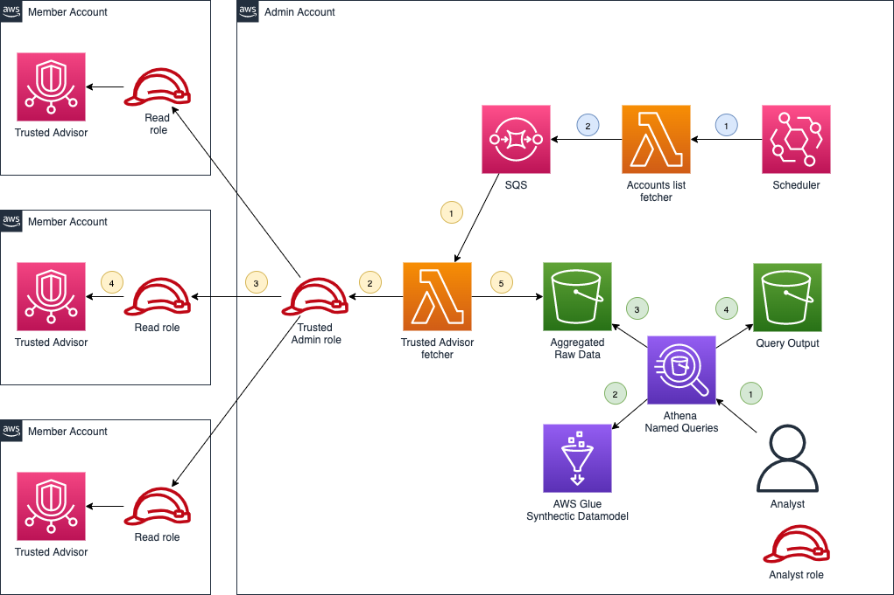

# aws-trusted-advisor-glue-aggregator

Code to deploy a solution to:
- periodically aggregate the Trusted Advisor checks results from different accounts to a centralised account, using AWS Lambda, AWS IAM, Amazon S3 and Amazon SQS 
- run analysis or report SQL queries on the aggregated data, using Amazon Athena, AWS Glue, Amazon S3

 ## Table of Contents

- [Description](#description)
- [Prerequisites](#prerequisites)
- [Dependencies](#dependencies)
- [Variables](#variables)
- [Usage](#usage)
- [Security](#security)
- [License](#license)

## Description

Following the AWS Organization Unit naming convention, we refer to the central data-analysis account as the admin account; and to the target data accounts as the member accounts.

### Admin account module
This Terraform module creates resources supporting three flows:
- An Amazon EventBridge scheduler periodically invoke an AWS Lambda function to obtain the latest list of AWS Accounts to aggregate. It split the account ids into Amazon SQS Queue messages.
- AWS Lambda function is trigger for each account id in the Amazon SQS Queue, and chain roles to retrieve member account AWS Trusted Advisor checks results. It write them in raw JSON format in a centralised Amazon S3 bucket.
- AWS  Glue map raw-data structure to a synthetic RDMS data-model that can be query in SQL via Amazon Athena, to generate CSV reports or extracts in an Amazon S3 bucket. 
The module includes all needed roles for the proper access of the services.
The module includes logs eviction management for the relevant services.

### Member account module

This Terraform module creates an AWS IAM role allowed to read AWS Trusted Advisor checks results and create trust for the admin account role to assume it.

### Architecture
The following diagram describes the full architecture.



**Blue flow:** obtains list of accounts in scope
1. Periodically trigger the "refresh data" process
2. Retrieve list of accounts. Created an SQS message for each account ID

**Yellow flow:** retrieve Trusted Advisor data 
1. Invoke Lambda function for each message 
2. Assume trusted admin role
3. Assume member account role
4. Call Trusted Advisor API to get data
5. Save data in S3 Bucket

**Green flow:** analyse data
1. Run an Athena Query
2. Athena Query look how to map the raw data to the synthetic data-model
3. Athena Query read and process the data
4. Athena Query save the query result


## Prerequisites
 
* **AWS Premium Support subscription**: 
AWS Business Support or AWS Enterprise Support subscription is required to use this code, as it leverage AWS Trusted Advisor APIs which are available only to these levels of subscription.

## Dependencies

* **terraform**: 1.2.7 [Reference](https://github.com/hashicorp/terraform)

## Use

The available variables are described in [variables.tf](./variables.tf) file for each module.

### Deployment

> Pay attention:
Both modules are meant to be used as standalone modules. They have to be deployed independently to the relevant AWS accounts
The Member module is to be deployed on each member account. 

**Option 1:**
You can inspire from [main.tf](./main.tf) to use the modules directly within your code.    
Please have a look inside inside [variables.tf](./variables.tf) for all the possible options.

**Option 2:**
Alternatively, if you have [Terraform](https://www.terraform.io/) installed on your workstation, you can deploy the example by executing:

```bash
export AWS_PROFILE=<profile>
export AWS_DEFAULT_REGION=eu-west-1

terraform plan -target=module.reporting-admin-module -var region=$AWS_DEFAULT_REGION -var profile=$AWS_PROFILE
terraform apply -target=module.reporting-admin-module -var region=$AWS_DEFAULT_REGION -var profile=$AWS_PROFILE

terraform plan -target=module.reporting-member-module -var region=$AWS_DEFAULT_REGION -var profile=$AWS_PROFILE
terraform apply -target=module.reporting-member-module -var region=$AWS_DEFAULT_REGION -var profile=$AWS_PROFILE
```

> Pay attention:
you should first modify the `AWS_DEFAULT_REGION` in accordance to your requirements.

### Testing

Each organisation has its own way to maintain and expose its inventory of AWS Accounts.
It is beyond the scope of this article to cover all the options to choose as scope of member accounts (ie: static list, database/file dynamic list, AWS Organization Unit based, etc.)

To support accounts dynamically joining and exiting the scope of analysis, the list of member accounts is re-evaluated each time at runtime.   
This educational code allow to hardcode simple list of 2-3 accounts in [fetch_accounts_metadata.py](./modules/reporting-admin-module/src/lambda/functions/fetch_accounts_metadata/fetch_accounts_metadata.py) for immediate testing purpose. 
But the reader should replace it by custom logic, adapted to its organisation context, for more advanced usage.

**Option 1: AWS Console**
You can use the AWS Console to:
- see raw data files aggregated in Amazon S3 bucket
- run Amazon Athena named or custom queries
- see query results in Amazon S3 bucket

**Option 2: AWS CLI**

```bash
export randomPrefix=<prefix output displayed by Terraform at deployment>

aws lambda invoke --function-name $randomPrefix-reporting-fetch-accounts-metadata:LIVE out.json
jq --color-output . out.json

aws logs tail /aws/lambda/$randomPrefix-reporting-fetch-accounts-metadata
aws logs tail /aws/lambda/$randomPrefix-reporting-fetch-trusted-advisor
aws s3 ls s3://$randomPrefix-reporting
```

### Cleanup

Use with caution:

```bash
rm out.json
terraform destroy -var region=$AWS_DEFAULT_REGION -var profile=$AWS_PROFILE
```

## Security

See [CONTRIBUTING](CONTRIBUTING.md) for more information.

## License

This project is licensed under the Apache-2.0 License.

=======

